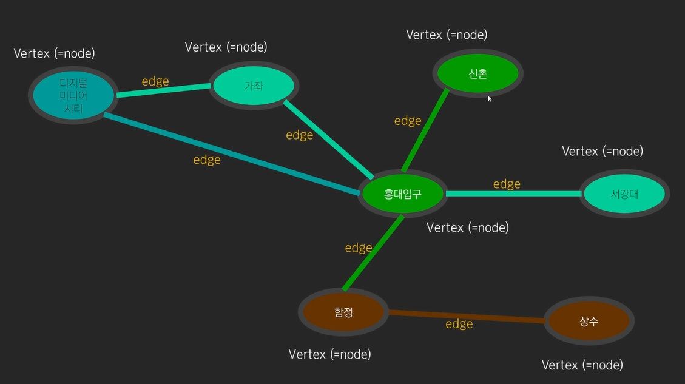
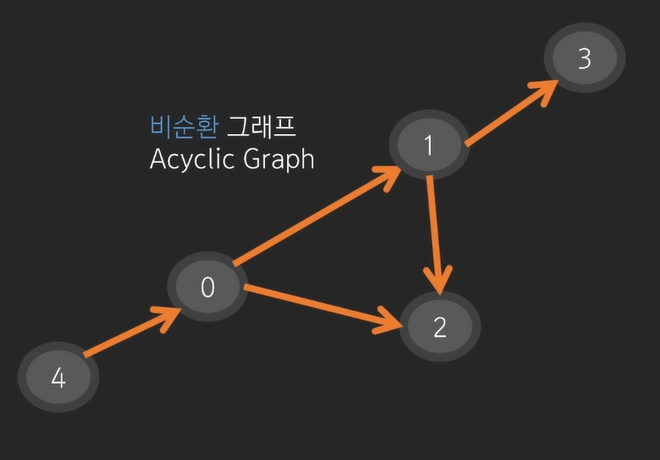
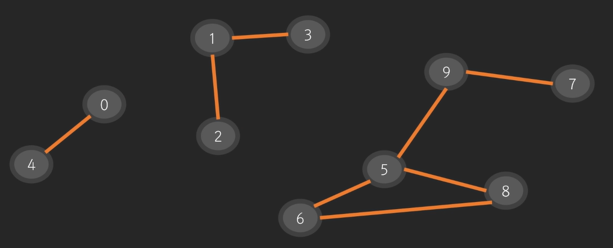
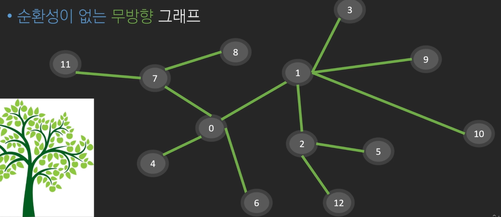
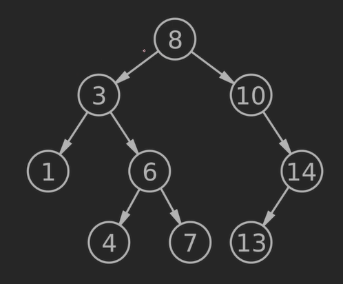
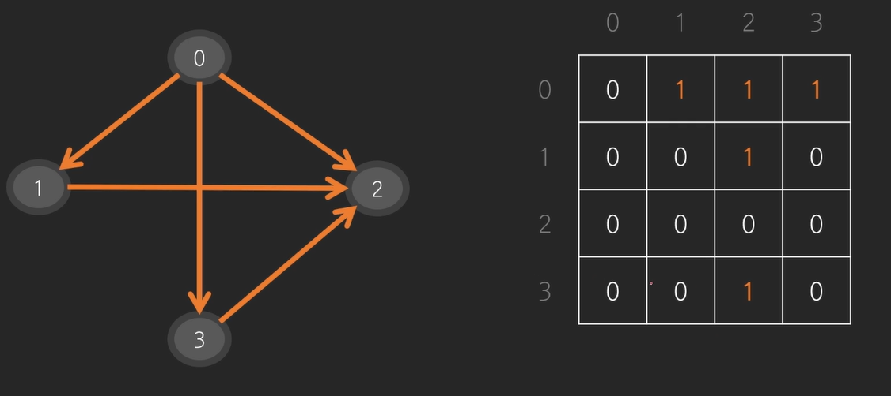
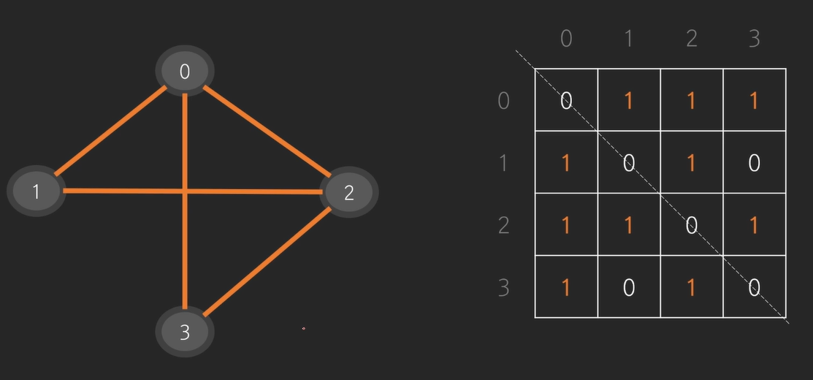
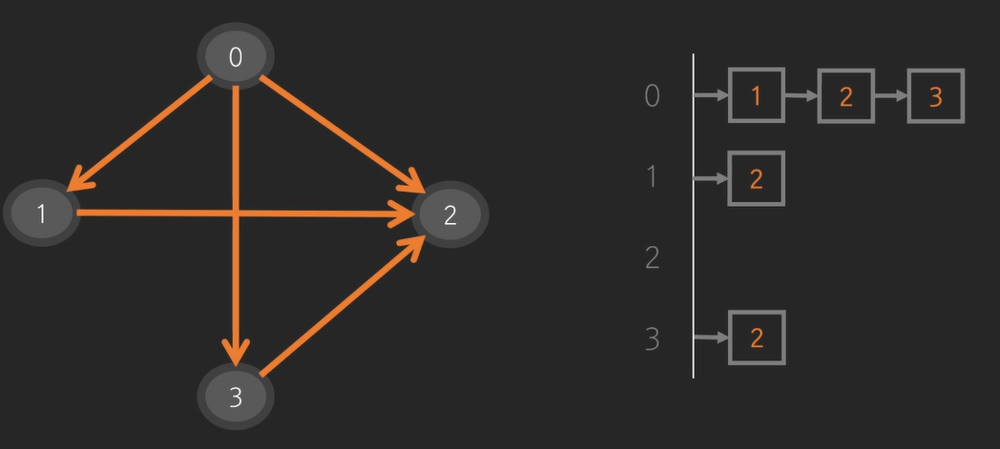
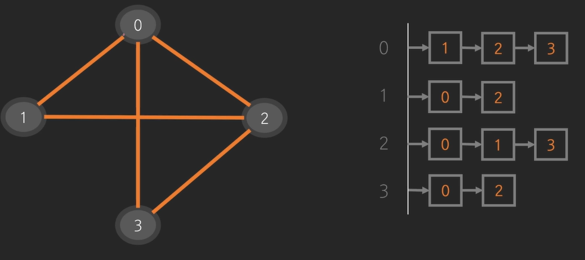

# DFS, BFS, 백트래킹
## 그래프
- 포인트를 연결하는 선으로 이루어 진 것
> **그래프 예**  
> - 지도 네비게이션  
> - SNS / 메신저
> - VCS (버전관리 시스템)  

- 각각의 포인트 : Vertex(=node)
- 노드를 잇는 간선 : edge  

간선이 E(M)개, 정점이 V(N)개.. 와 같은 식으로 주어진다.
---
### 무방향 그래프(=양방향 그래프)
0번, 1번 노드 아무렇게나 갈 수 있다
### 방향 그래프 
0 -> 1번 노드로 갈 수 있지만  
1 -> 0번 노드로 갈 수 없다.
### 순환 그래프

- 사이클이 있다(0, 1, 2번 노드)
### 비순환 그래프

- 사이클이 없다
### 연결 요소

- 위 사진 전체가 하나의 그래프
- 10개의 노드, 8개의 간선
- 3개의 연결요소로 이루어 져 있다.

---
## 트리

- root node : 시작 노드, 어떤 노드도 root가 될 수 있다.
- leaf node : 가장 바깥쪽 노드 
- nodeA -> nodeB 가는 경로는 반드시 존재하고, 유일하다
- 노드개수 = 간선개수 + 1

### 자료구조에서의 트리

- 자료구조에서 트리는 부모, 자식 관계가 있는 방향 그래프이다.
- root는 하나이다.
---
## 코드로 그래프 나타내기
### 인접행렬로 나타내기
#### 1. 방향 그래프

간선의 정보를 **2차원 배열로 나타낼 수 있다**  
- 행 : 출발 노드 
- 열 : 도착 노드  

#### 2. 무방향 그래프
 
 - 대각선 방향으로 대칭구조를 띄고 있다.  

### 인접리스트로 나타내기

#### 1. 방향 그래프

#### 2. 무방향 그래프

### 행렬, 리스트 비교
>인접행렬의 경우 간선이 없는 경우 0으로 할당  
인접리스트의 경우  간선이 없는 경우 빈 리스트로 구성  

`시간 <-> 공간` Trade-off관계
#### 인접 행렬
- 장점 : 노드가 N개인 경우 $N^2$만큼 공간을 생성해야한다.(메모리 최대)
- 단점 : 빠르게 탐색 가능(시간 최소)

#### 인접 리스트
- 장점 : 간선이 없는 경우 공간을 할당 할 필요가 없다.(메모리 최소)
- 단점 : 빠르게 탐색 가능(시간 최대)