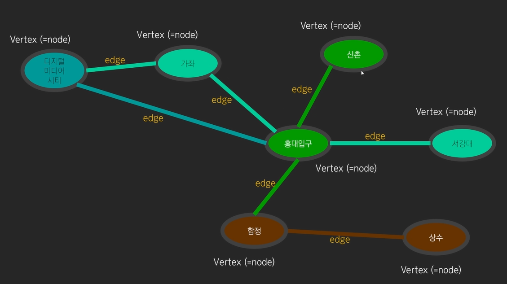
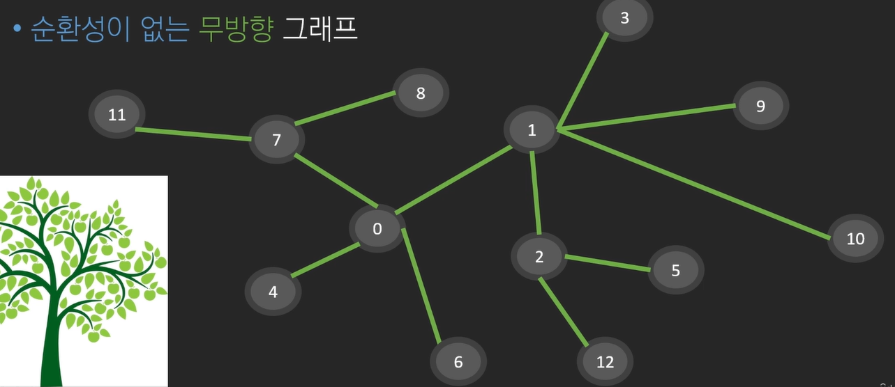
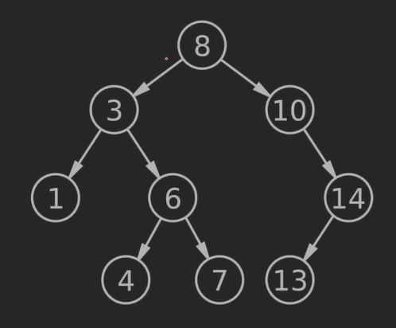
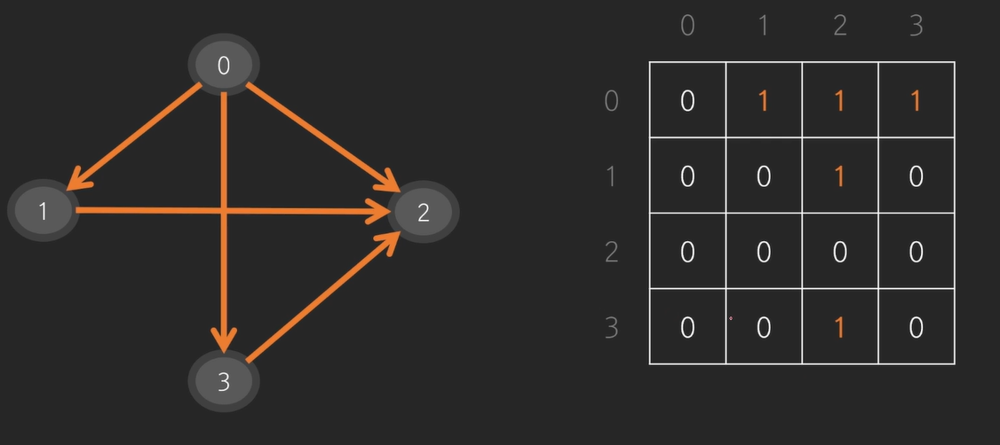
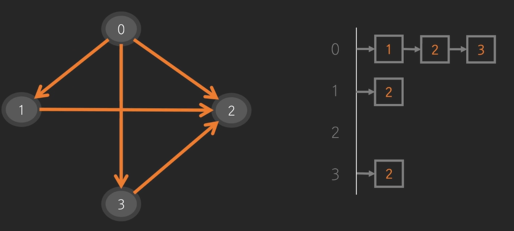
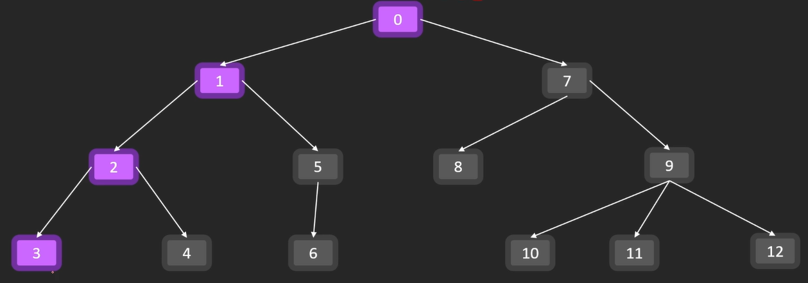
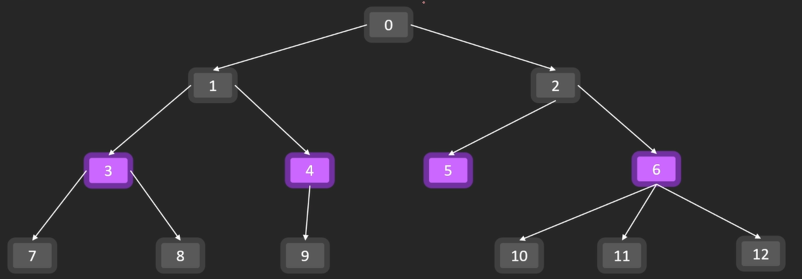

# DFS, BFS, 백트래킹
## 그래프
- 포인트를 연결하는 선으로 이루어 진 것
> **그래프 예**  
> - 지도 네비게이션  
> - SNS / 메신저
> - VCS (버전관리 시스템)  


- 각각의 포인트 : Vertex(=node)
- 노드를 잇는 간선 : edge  

간선이 E(M)개, 정점이 V(N)개.. 와 같은 식으로 주어진다.
---
### 무방향 그래프(=양방향 그래프)
0번, 1번 노드 아무렇게나 갈 수 있다
### 방향 그래프 
0 -> 1번 노드로 갈 수 있지만  
1 -> 0번 노드로 갈 수 없다.
### 순환 그래프

- 사이클이 있다(0, 1, 2번 노드)
### 비순환 그래프

- 사이클이 없다
### 연결 요소

- 위 사진 전체가 하나의 그래프
- 10개의 노드, 8개의 간선
- 3개의 연결요소로 이루어 져 있다.

---
## 트리

- root node : 시작 노드, 어떤 노드도 root가 될 수 있다.
- leaf node : 가장 바깥쪽 노드 
- nodeA -> nodeB 가는 경로는 반드시 존재하고, 유일하다
- 노드개수 = 간선개수 + 1

### 자료구조에서의 트리

- 자료구조에서 트리는 부모, 자식 관계가 있는 방향 그래프이다.
- root는 하나이다.
---
## 코드로 그래프 나타내기
### 인접행렬로 나타내기
#### 1. 방향 그래프

간선의 정보를 **2차원 배열로 나타낼 수 있다**  
- 행 : 출발 노드 
- 열 : 도착 노드  

#### 2. 무방향 그래프
 
 - 대각선 방향으로 대칭구조를 띄고 있다.  

### 인접리스트로 나타내기

#### 1. 방향 그래프

#### 2. 무방향 그래프


### 행렬, 리스트 비교
>인접행렬의 경우 간선이 없는 경우 0으로 할당,  
인접리스트의 경우  간선이 없는 경우 빈 리스트로 구성  

`시간 <-> 공간` Trade-off관계
#### 인접 행렬
- 장점 : 빠르게 탐색 가능 $O(1)$ (시간 최소)
- 단점 : 노드가 N개인 경우 $N^2$만큼 공간을 생성해야한다.(메모리 최대)

#### 인접 리스트
- 장점 : 간선이 없는 경우 공간을 할당 할 필요가 없다.(메모리 최소)
- 단점 : 각 노드의 모든 간선을 확인해야 한다. $O(N)$ (시간 최대)
---
### 정리
대부분의 경우 둘 중 어느것을 사용해도 통과가 되나, 난이도가 어려운 경우 선택해야한다.
#### 인접 행렬 사용
>정점 $N$개 간선 $N^2$개
- 간선이 노드보다 훨씬 많은경우 (탐색에 시간소요가 많이 걸리는 경우)

#### 인접 리스트 사용
>정점 $N$개 간선 $2N$개
- 간선이 비교적 적은 경우

## DFS
- Depth First Search : 깊이 우선 탐색



1. 한 노드에서 갈 수 있는 가장 끝 노드까지 간다.(0->1->2->3)
2. 더이상 갈 수 있는 간선이 없는 경우 이전노드로 돌아 간 후 다른 간선을 탐색(3->2로 복귀 후 2->4 탐색)
3. 모든 노드를 탐색한 경우 종료

### 위 트리 인접행렬 DFS 구현
- 스택 or 재귀를 사용해서 구현한다.

```python
# 0으로 채워진 (13, 13)행렬 생성
adj = [[0]*13 for _ in range(13)]
adj[0][1] = adj[0][7] = 1
adj[1][2] = adj[1][5] = 1
# ... 모든 간선 반복

# 방문기록 체크 작성
visited = [False] * 13

# 가독성 좋게 출력
for row in adj:
    print(row)

# dfs(인접행렬, 시작노드, 방문기록)
def dfs(adj, i, visited):
    visited[i] = True # 방문한 곳 체크
    print(i, end = ' ') # 방문순서 출력
    for c in range(len(adj[i])):
        # 간선이 있고, 방문한적이 없는 경우
        if adj[i][c] == 1 and not visited[c]:
            # 재귀함수 호출
            dfs(adj, c, visited)
```

## BFS
- Breadth First Search : 너비우선탐색
DFS와 탐색순서가 다름  



1. 첫번째 노드에서 갈 수 있는 모든 간선 탐색(0 에서 1, 2 탐색)
2. 두번째 노드에서 갈 수 있는 모든 간선 탐색(1, 2에서 3,4,5,6 탐색)
3. 무한반복(3,4,5,6에서 7,8,9...12탐색)
### 위 트리 인접행렬 BFS 구현
- 큐를 사용해서 구현
```python
from collections import deque

# 0으로 채워진 (13, 13)행렬 생성
adj = [[0]*13 for _ in range(13)]
adj[0][1] = adj[0][7] = 1
adj[1][2] = adj[1][5] = 1
# ... 모든 간선 반복

# 방문기록 체크 작성
visited = [False] * 13

# bfs(인접행렬, 시작노드, 방문기록)
def bfs(adj, i, visited):
    dq = deque()
    #root노드 append
    dq.append(i) 
    while dq: # 비어있을때 까지 반복
        value = dq.popleft()
        if not visited[value]:
            print(value, end = ' ')
            visited[value] = True
        for c in range(len(adj[value])):
            # 간선이 있고, 방문한적이 없는경우
            if adj[value][c] == 1 and not visited[c]: 
                dq.append(c) # 다음노드 append
```

## DFS & BFS 비교
- 공통점
> - 그래프 탐색, 완전탐색 알고리즘
> - 반드시 답을 찾는다, 탐색속도가 느리다.
- 차이점
> - 탐색 순서가 다르다.
> - 최단거리를 찾는경우 BFS가 빠르다.
## 백트래킹 : 퇴각검색
- DFS,BSF와 달리 가지치기를 통해 경우의 수를 줄임
- '가망성이 없으면 가지않는다.'  

>ex) 감점 없이 게임을 clear해야 하는 경우
>- -1점을 받게 된 경우 진행하지 않는다. 