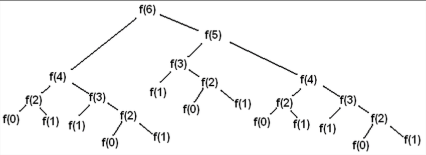

# 동적계획법 Dynamic Programming
문제를 쪼개서 작은 문제의 답을 이용해 더 큰 문제의 답을 구하는 것을 반복.  

>**Dynamic과 별개의 지식**   
>프로그래밍에서 컴파일 후 나온 결과를 실행하는것을 런타임.  
>- 컴파일 단계에서 일어나는것을 정적 > Static
>- 런타임 단계에서 일어나는 것을 동적 > Dynamic  

***동적 계획법은 위와 큰 관련은 없다.***

## DP 구현 2가지
|       |Top-down   |Bottom-up |
|-------|-----------|----------|
|구현   |재귀        |반복문    |
|저장방식|Memoization|Tabulation|
- Memoization(메모이제이션)  
: 부분 문제들의 답을 cache에 저장, 필요시 사용(중복연산 방지)  

- Tabulation(타뷸레이션)  
: 부분 문제들의 답을 미리 다 구해 둔다. 

## 피보나치 수열
>$f(0) = 0$  
>$f(1) = 1$  
>$f(i+2) = f(i+1) + f(i)$


```python
# 일반 구현
def f(n):
    if n == 0:
        return 0
    elif n == 1:
        return 1

    # 리턴값으로 재귀함수 호출...    
    return f(n-1) + f(n-2)
print(f(int(input())))
```
$f(6)$을 구하기 위해 $f(i)$의 모든 값을 구해가면서 최종적으로 $f(6)$을 구할 수 있지만, 많은 계산과정이 필요.. (시간초과 발생)  


```python
# 메모이제이션 구현
# 0~90까지 input이 주어지는 경우 (백준 2748문제 참고)
cache = [-1] * 91
cache[0] = 0
cache[1] = 1

def f(n):
    if cache[n] == -1:
        cache[n] = f(n-2) + f(n-1)
    return cache[n]
print(f(int(input())))

#  for문 사용시 
n = int(input())
for i in range(2, n+1):
    cache[i] = cache[i-1] + cache[i-2]
print(cache[n])

```

$f(6)...f(1)$ 6가지의 답을 알고 있다면 반복적인 계산이 필요없어져 두 번째 사진과 같이 많은 계산과정 없이 해결 가능 (빨간x표시 : 호출 될 필요가 없는 값들)